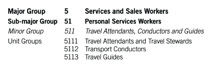

# Verifiable Credentials #1 

### Requirements to Accept a VC

---

## Background

Financial institutions (both MSBs and traditional Banks) are required to collect personally identifiable information and verify the identity of their customers before allowing the customer to transact. In some unique cases, customer verification is not required for transactions under a certain dollar threshold, but this does not specifically address those use cases. We also highly recommend companies consider **selective disclosure** or **zero-knowledge proof** techniques to further enhance user privacy.


## Purpose

This deliverable attempts to define the **_Vocabulary_** for KYC Verifiable Credentials and tackle some of the important open questions regarding the substance, acceptance criteria, trust framework and use cases for KYC Verifiable Credentials.


## Definitions

**<span style="text-decoration:underline;">Verifiable Credential:</span>** A tamper-evident digital presentation of personal information that needs to be proved. For the purpose of this document we will focus on KYC credentials that mirror physical identity documents and proofs.

**<span style="text-decoration:underline;">Verifiers:</span>** Financial Institutions and other types of companies willing to accept a credential.

**<span style="text-decoration:underline;">Issuers:</span>** Any entity with the qualifications to issue a credential. This can include financial institutions, identity verification vendors, AML compliance vendors and others.

**<span style="text-decoration:underline;">Trust Establishment Document:</span>** Verifiers can maintain a Trust Establishment Document of Issuers whom they trust for which credentials, either based on certain public information (regulated entities for example) or who they have validated are qualified to issue certain verifiable credentials.

**<span style="text-decoration:underline;">Schemas:</span>** [JSON Schema](https://json-schema.org/), [JSON Linked Data](https://json-ld.org/), or [Schema.org](https://schema.org/Person) documents that proivde semantic meaning and field-level validation to credentials.

**<span style="text-decoration:underline;">Presentation Exchange:</span>** [A protocol by which](https://identity.foundation/presentation-exchange/) _Verifiers_ can request _Credentials_ from _Holders_ via _Presentation Requests_, and by which _Holders_ can submit responses _Presentation Requests_ to _Verifiers_ via _Presentation Submissions_.

## Acceptance Criteria

In order for DIDs and VCs to be adopted by financial institutions, they need to comply with all applicable laws and regulations (specifically BSA AML and KYC requirements). Therefore, the credential must:


1. **Standard DID Vocabulary:** The credential must include certain basic information to be accepted and recognized by the verifier, including information about the issuer, issuance date and time stamp, the DID reference, the schema backing the credential, and the digital signature (or proof). It will also contain the **revocation controls** and **terms of use**, which we will address in a future work item due to complexity.

2. **CIP/KYC Vocabulary:** Include information that is required to be **_collected and verified_** to comply with applicable financial regulations.  In the USA, regulations require the collection of the full name, date of birth, residential address and SSN (for individuals). In Europe and the UK that also includes Nationality, Proof of Address and certain enhanced due diligence information such as employment information and purpose of account.

3. **Identity Verification Evidence:** Provide **_evidence_** of identity verification including: the method for verifying identity (i.e. documentary vs. non documentary), the source of the verification (i.e. ID type or public records), information about what was used to verify (i.e. name matched DOB and SSN), any information that was unmatched (i.e. address did not match), and the name of the third party that performed the verification. 

    In addition, if the verification method is “documentary”, then the VC must include information about the document used to verify (usually a photo ID) such as: the document type, issuing state and country, and the document expiry date.

4. **Address or Account Verification Evidence:** Financial transactions in the UK, Europe and other countries outside the USA requires a verification of an address in addition to identity verification (above). Typical documents used to verify an address are a utility bill, bank statement, or telecom account statement. Address verification can also be used to verify an account, such as a bank account or exchange account and can be used for the purpose of validating source of funds, a common enhanced due diligence requirement globally.

5. **Sanctions Screening:** Certify that the individual is not from a sanctioned country or on the appropriate sanctions lists (note that each country has its own sanctions lists, it is not feasible to compare the customer against ALL global lists, so these VCs may need to be regional).

    For this certification to be valid/accepted it must provide information about the lists that were checked against, the date the check was performed, the third party that performed the checks and additional information about any matches. 


    **_Note: Because of the complexity of representing sanctions checks as verifiable credentials, we have decided to address this in a separate work item._**


## KYC VC Examples

This section provides examples of the data collected for each acceptance criteria listed above and outlines the vocabulary for each data type.


### 1. Standard DID Vocabulary

A financial institution (or Verifier) asks an individual for a KYC Credential they control. The individual responds with:

**<span style="text-decoration:underline;">Example 1: Verifiable Credential & Proof</span>**

In this example, the KYC Provider is identified by the DID `did:example:BlockInc` and the individual identified by `did:example:1a2b3c4d5e6f7g`.

```json
{
   "@context": ["https://www.w3.org/2018/credentials/v1"],
   "id": "8beaf6db-c636-4874-9997-445b31ea2596",
   "type": ["VerifiableCredential"],
   "issuer": "did:example:BlockInc",
   "issanceDate": "2010-01-01T00:00:00Z",
   "credentialSubject": { 
      "id": "did:example:1a2b3c4d5e6f7g",
      "...": "..."
   },
   "proof": { "..." }
}
```

The Verifier can use the Issuer's DID to optionally:

1. Cross reference the Issuer DID against an established Trust List that they maintain,
2. Discover information through the Issuer’s DID or DID website, or
3. Decide to trust the VC based on the contents and signature proof meeting their requirements.

**<span style="text-decoration:underline;">Example 2: Resolve Issuer DID</span>**

[Resolution of the Issuer's DID](https://w3c-ccg.github.io/did-resolution/) yields the result:

```json
{
   "@context": [
      "https://www.w3.org/ns/did/v1",
      "https://w3id.org/security/suites/ed25519-2020/v1"
  ],
   "id": "did:example:BlockInc",
   "authentication": [{
      "id": "did:example:BlockInc#keys-1",
      "type": "Ed25519VerificationKey2020",
      "controller": "did:example:BlockInc",
      "publicKeyMultibase": "zH3C2AVvLMv6gmMNam3uVAjZpfkcJCwDwnZn6z3wXmqPV"
   }],
   "serviceEndpoint" : {
      "id": "did:example:BlockInc#dwn-1" ,
      "type": "DWN",
      "serviceEndpoint": "https://example.com/my-dwn" 
   }
}
```

### 2. CIP/KYC Vocabulary

The KYC Credential for a global customer will include some or all of the following data fields:

<table>
  <tr>
   <td><strong>Vocabulary</strong></td>
   <td><strong>Field Description & References</strong></td>
  </tr>
  <tr>
   <td>Family Name</td>
   <td>Refer to <a href="https://schema.org/Person">Person Schema</a>
<p>
In the USA, the Family Name is the <strong>Last Name</strong> of a Person
   </td>
  </tr>
  <tr>
   <td>Given Name</td>
   <td>Refer to <a href="https://schema.org/Person">Person Schema</a>
<p>
In the USA, the Given Name is the <strong>First Name</strong> of a Person
   </td>
  </tr>
  <tr>
   <td>Additional Name</td>
   <td>Refer to <a href="https://schema.org/Person">Person Schema</a>
<p>
This can be used to include <strong>Middle Name</strong> or left blank or n/a
   </td>
  </tr>
  <tr>
   <td>Birth Date (DOB)</td>
   <td>Universal Date Format (<a href="https://www.iso.org/iso-8601-date-and-time-format.html">ISO 8601</a>): YYYY/MM/DD</td>
  </tr>
  <tr>
   <td>Postal Address </td>
   <td>Refer to <a href="https://schema.org/PostalAddress">Postal Address Schema</a>
<p>
Data fields should include: 
<p>
“addressCountry” - Country using the <a href="https://www.iso.org/iso-3166-country-codes.html">ISO</a> 3 Alpha Character country abbreviation
<p>
“addressLocality” - City or locality within a region
<p>
“addressRegion” - County, Province or State (US)
<p>
“postOfficeBoxNumber” - not a valid address for financial transactions in the US
<p>
“postalCode” - Zip Code in the USA
<p>
“streetAddress” - House number and Street name for example “601 Church Street”
   </td>
  </tr>
  <tr>
   <td>TaxID
   </td>
   <td>Refer to <a href="https://schema.org/Person">Person Schema</a>
<p>
“123-45-6789” This can include an SSN or ITIN (in the US), National ID number (in Canada), or other government issued identity number. 
   </td>
  </tr>
  <tr>
   <td>Nationality</td>
   <td>Refer to <a href="https://schema.org/Person">Person Schema</a>
<p>
Nationality of the Person, Country using the <a href="https://www.iso.org/iso-3166-country-codes.html">ISO</a> 3 Alpha Character country abbreviation
   </td>
  </tr>
  <tr>
   <td>Gender</td>
   <td>This is not typically required in certain countries due to gender descrimination (UDAAP for example), but is required in Asia and other parts of the world. 
<p>
<strong>Note:</strong> While https://schema.org/Male and https://schema.org/Female may be used, text strings are also acceptable for people who do not identify as a binary gender.
   </td>
  </tr>
  <tr>
   <td>Account Type</td>
   <td>We may need this field to determine the type of account being opened or n/a if no account is being opened and this is a one-off transaction.
<p>
We can use Schema.org references for <a href="https://schema.org/docs/financial.html">financial extension hierarchy</a> under FinancialProduct Service, but this does not cover all different account types possible.
   </td>
  </tr>
  <tr>
   <td>Purpose of Account</td>
   <td>Standardize possible responses to include:
<ul>
<li>deposit,
<li>checking,
<li>savings,
<li>investing,
<li>sending/receiving money,
<li>currency conversion,
<li>cryptocurrency trading
</li>
</ul>
   </td>
  </tr>
  <tr>
   <td>Occupation</td>
   <td>Suggest we separate this field into it's own employment verifiable credential. Refer to considerations for more information. Alternatively, we can use the <a href="https://isco-ilo.netlify.app/en/isco-08/">ISCO-08</a> International Standard Classification of Occupations either at the sun-major group or minor group level to reduce the possible values for this field
<p>
<span style="text-decoration:underline;">Example of ISCO-08:</span>
<p>



   </td>
  </tr>
  <tr>
   <td>Employer Name (“worksFor” on Schema.org)</td>
   <td>Free text field. Note: this is only required by certain financial institutions and can be hard to validate. Therefore, suggest we separate out in an employment specific credential with the data field above.</td>
  </tr>
  <tr>
   <td>Source of Funds/Wealth</td>
   <td>Standardize possible responses include:
<ul>
<li>employment,
<li>self-employment, 
<li>investment, 
<li>savings, 
<li>retirement, 
<li>gift/inheritance, or 
<li>other (which must come with an explanation in free text)
</li>
</ul>
   </td>
  </tr>
  <tr>
   <td>Account Activity</td>
   <td>Free text field. Expected transaction amount or volume information is typically asked to assess risk and comply with regulatory obligations.</td>
  </tr>
</table>


Note, that the contents of this type of credential relies on existing and accepted global data schema’s to enhance consistency and interoperability.

To obtain the information contained within the KYC Verifiable Credential, the Financial Institution (or Verifier) will specify the credential schemas and types they accept via a [Presentation Request](https://identity.foundation/presentation-exchange/#presentation-request).

Such KYC Credentials may be formed as follows:

**<span style="text-decoration:underline;">Example 2: KYC VC (USA):</span>**

```json
{
   "@context": ["https://www.w3.org/2018/credentials/v1"],
   "id": "8beaf6db-c636-4874-9997-445b31ea2596",
   "type": ["VerifiableCredential", "US-KYC"],
   "issuer": "did:example:KYC-Issuer",
   "credentialSubject": {
      "id": "did:example:1a2b3c4d5e6f7g",
      "name": {
         "familyName": "Doe",
         "givenName": "Jane"
      },
      "birthDate": "1999/12/25",
      "postalAddress": {
         "streetAddress": "31 South Main Street",
         "country": "USA",
         "locality": "Anytown",
         "region": "Anystate",
         "postalCode": "12345"
      },
      "taxId": "123-45-6789"
   },
   "proof": { "..." }
}
```

**<span style="text-decoration:underline;">Example 3: KYC VC (EU/UK):</span>**

```json
{
   "@context": ["https://www.w3.org/2018/credentials/v1"],
   "id": "8beaf6db-c636-4874-9997-445b31ea2596",
   "type": ["VerifiableCredential", "EU-UK-KYC"],
   "issuer": "did:example:KYC-Issuer",
   "credentialSubject": {
      "id": "did:example:1a2b3c4d5e6f7g",
      "name": {
         "familyName": "Biche",
         "givenName": "Jean"
      },
      "birthDate": "1999/12/25",
      "postalAddress": {
         "streetAddress": "31 rue Perdu",
         "country": "FRA",
         "locality": "La Ville",
         "region": "Ile-de-France",
         "postalCode": "75000"
      },
      "nationality": "FRA",
      "accountType": "DepositAccount",
      "purposeOfAccount": "Deposits",
      "occupationalCategory": "3123 Construction Supervisors",
      "sourceOfFunds": "Employment" 
   },
   "proof": { "..." }
}
```

**Note:** EU and UK AML regulations require both a Photo ID and address verification, so to meet compliance requirements in these jurisdictions the verifiable credential will require the additional evidence outlined in Section 3 and 4 below to be considered valid.

#### Additional Considerations

1. The employment information requested at onboarding (or during EDD) is typically not easily validated. Compliance teams use this information to either investigate an account or validate the account activity. Collecting the information alone does not add significant value, rather if this information was contained within an employment credential that was issued by a qualified issuer, such as Workday or your employer, the information would be more accurate, could be updated or refreshed when employment information changes and able to be trusted and relied on. Therefore, recommend that we remove this field from the KYC credential and focus on enabling a separate employment credential issued by a qualified organization.
2. Even for non documentary verification (when there is no document expiration date), we can set standard expiry dates within the credential. For example,  compliance standards dictate that KYC should be refreshed every 1-3 years based on risk.
3. We are recommending that initially we separate out the Identity and Address Verification Evidence from the KYC Verifiable Credential for several reasons:
 - For simplicity, we may want to start with more simple credentials which will be easier to digest and accept.
 - KYC information is constant, unless you change your name the information does not change. However, identity documents and account statements have expiration dates and need to be revoked and reissued on a regular basis. Separating them into separate credentials means one can be revoked when it is no longer valid while the other can remain intact.
 - By separating out the information in these credentials, users can limit the information that they share with others. For example, progressive onboarding is a common practice in the US, some companies may require only the collection of certain information to start transacting, and later request a photo ID or source of funds validation when the transaction volume reaches a certain threshold. This segregation allows the user to share only the information required, or to share more than one credential when more information is needed up front.
4. Standardized responses for fields are preferable to ensure standardization and to allow for easier storage and data formatting. Otherwise, each Verifier will need to map possible data fields to their own internal databases (to be fair this will need to be done anyway, but at least it will be a one time exercise. Please review and provide input on the possible responses for any fields that do. not have a standard schema.
### 3. Identity Verification Evidence Vocabulary

In order for the KYC Verifiable Credential to be accepted by most financial institutions, it needs to be verified using a standard method that is recognized by others. The following table outlines the information that should be included in order to provide evidence of identity verification (regardless of whether the documentary or non-documentary method is used). It is noted that the verification requirements differ by country and are more prescriptive in certain countries. Some countries may also require more than one method of verification (such as in Canada).


<table>
  <tr>
   <td><strong>Vocabulary</strong></td>
   <td><strong>Field Description & References</strong></td>
  </tr>
  <tr>
   <td>Method</td>
   <td>Documentary, non-documentary</td>
  </tr>
  <tr>
   <td>Source</td>
   <td>Photo ID, public records, official document, other document (<em>we need to determine the full list of acceptable documents</em>), note that this field is a high level description of the source, the document type is included below</td>
  </tr>
  <tr>
   <td>Match Result</td>
   <td>Full match (all data elements matched), partial match (3 out of 4 elements matched), match with issues (2 out of 4 elements matched), unmatched <em>(the issuer should not issue a VC based on an unmatched result)</em></td>
  </tr>
  <tr>
   <td>Unmatched Data</td>
   <td>Name, date of birth, address, TaxID or ID Number <em>(could be one or many)</em>. It is important to provide information on unmatched data, this does not make the VC invalid, but rather demonstrates the quality of the verification process</td>
  </tr>
  <tr>
   <td>Verifier Name</td>
   <td>Free text (examples Jumio, Onfido, Prove, etc.) suggest using the name here instead of a DID so that the Verifier does not need to resolve the DID information</td>
  </tr>
  <tr>
   <td>Document Type</td>
   <td>Drivers license, passport, permanent resident card, voter registration card, government ID, military ID, state ID card, n/a (for non documentary)</td>
  </tr>
  <tr>
   <td>Issuing State/Province</td>
   <td>Full name of state or province or n/a if not applicable</td>
  </tr>
  <tr>
   <td>Issuing Country</td>
   <td>Use the <a href="https://www.iso.org/iso-3166-country-codes.html">ISO</a> country abbreviation or full country name or n/a
   </td>
  </tr>
  <tr>
   <td>ID Number</td>
   <td>Document ID number, format will depend on ID type and country</td>
  </tr>
  <tr>
   <td>Expiry Date</td>
   <td>Universal Date Format (<a href="https://www.iso.org/iso-8601-date-and-time-format.html">ISO 8601</a>): YYYY/MM/DD (do we want to allow n/a?). Photo ID documents should usually have an expiry, but other documents such as birth certificates, utility bills, etc. will not)</td>
  </tr>
</table>


#### Additional Considerations

5. We may want to consider all possible sources for document verification even if they are atypical such as: social security card, utility bill, or birth certificate for example.
6. It is common for companies to compare KYC information to the information on an ID, this includes full name, date of birth and address. Therefore, we may want to consider how to replicate this process with verifiable credentials. To some extent this will be covered in the “Match Result”.

7. Companies also store a copy of the photo ID and/or the personal data from the ID, through OCR technology, at field level. This typically includes: Full name, Date of Birth, ID Type, ID Number, ID Country and address (if applicable). Therefore, we may want to consider including the personal information on the identity document within the verifiable credential evidence. 

To obtain the evidence that the KYC Verifiable Credential was verified, the Financial Institution (or Verifier) will specify the Verification Evidence credential schemas and types they accept via a [Presentation Request](https://identity.foundation/presentation-exchange/#presentation-request).


Such KYC Evidence may be associated with KYC Verifiable Credentilas **OR** provided as separate credentials. Such a credential, using the [Verifiable Credential Data Model Evidence Property](https://www.w3.org/TR/vc-data-model/#evidence) may appear as follows:

**<span style="text-decoration:underline;">Example 4: KYC VC Evidence </span>**

```json
{
   "@context": ["https://www.w3.org/2018/credentials/v1"],
   "id": "8beaf6db-c636-4874-9997-445b31ea2596",
   "type": ["VerifiableCredential", "KYC-Evidence"],
   "issuer": "did:example:KYC-Issuer",
   "credentialSubject": {
      "id": "did:example:1a2b3c4d5e6f7g",
      "name": {
         "familyName": "Doe",
         "givenName": "Jane"
      },
      "birthDate": "1999/12/25",
      "postalAddress": {
         "streetAddress": "31 South Main Street",
         "country": "USA",
         "locality": "Anytown",
         "region": "Anystate",
         "postalCode": "12345"
      },
      "taxId": "123-45-6789"
   },
   "evidence": [{
      "id": "https://kyc-provider.com/evidence/evidence-id.json",
      "type": ["KYC-Documentary-Evidence"],
      "method": "Documentary",
      "source": "Photo ID",
      "match": {
         "result": "Partial match",
         "unmatchedData": "SSN"
      },
      "verifierName": "Jumio",
      "documentType": "Passport",
      "issuingCountry": "USA",
      "idNumber": "123456789",
      "expiryDate": "2026/12/25"
   }],
   "proof": { "..." }
}

```

### 4. Address Verification Evidence

Address verification is a regulatory requirement to onboard a customer in certain jurisdictions including in the UK, Europe and parts of Asia. This same type of credential can also be used to demonstrate proof of “Purpose Of Account”, if a bank or other financial account statement is used to validate a physical address.

The Address or Account Verification Evidence will be requested by a Financial Institution when:


1. Regulatory requirements dictate that address verification is required to onboard a customer based on risk; or
2. Enhanced Due Diligence is performed (due to the risk associated with an account or customer) and proof of the purpose account or source of funds is required (either via a regulatory requirement or internal policy).

<table>
  <tr>
   <td><strong>Vocabulary</strong></td>
   <td><strong>Field Description & References</strong></td>
  </tr>
  <tr>
   <td>Statement Type</td>
   <td>Bank statement, brokerage statement, utility bill, phone bill, trading account statement, custodial account, other (with free text field to describe the document)
   </td>
  </tr>
  <tr>
   <td>Statement Date</td>
   <td>Universal Date Format (<a href="https://www.iso.org/iso-8601-date-and-time-format.html">ISO 8601</a>): YYYY/MM/DD. The document is usually only valid if issued within the last 3 or 6 months (depends on the requirements).
   </td>
  </tr>
  <tr>
   <td>Company Name</td>
   <td>Free text field to provide the name of the company that issued the statement. For example: “AT&T”, “HSBC Bank”, “Coinbase”, etc.
   </td>
  </tr>
  <tr>
   <td>Account Number</td>
   <td>Allow for multiple formats and n/a or blank if not applicable
   </td>
  </tr>
  <tr>
   <td>Account Balance</td>
   <td>This is only applicable for certain types of accounts (typically financial accounts) and is important when verifying source of funds or purpose of account information. Need to include local currency type, for example “USD”, “RMB”, or “MXN”. Note that for certain types of accounts (such as credit cards) "Available Credit" is a more accurate field name. Consider both field options.
   </td>
  </tr>
    <tr>
   <td>Account Status</td>
   <td>The account status is important to determine if an account is valid and can be used. The account status types can include: <em>active</em>, <em>blocked</em>, <em>inactive</em>, <em>bank account frozen</em>, <em>non-payment bank account</em>, etc. There are standard ACH return codes which can also be used here (these are typical responses to transaction requests) but would not be applicable for open/active accounts. Also, given the different account types possible, mapping to standardized responses would be beneficial.
   </td>
  </tr>
  <tr>
   <td>Customer Name</td>
   <td>Full name of the customer on the account, can include both names when it is a joint account. This is necessary to confirm the statement is for the individual named in the KYC credential.
   </td>
  </tr>
  <tr>
   <td>Customer Address</td>
   <td>Option to use a single data field to document the full address (such as “postalAddress”) or break out at field level per the <a href="https://schema.org/PostalAddress">Postal Address Schema</a>. This is necessary to compare to the KYC address.
   </td>
  </tr>
</table>


#### Additional Considerations 

8. Regulatory requirements and compliance controls may require the collection and storage of the statement, therefore it is important to consider how to comply with this requirement with verifiable credentials. For example, can or should we embed an image of the statement in the credential?
9. This credential assumes that we use online verification tools and vendors to produce address and account information to meet this regulatory compliance requirement. Please note that currently, many financial institutions require the user to upload a copy of a physical statement to comply with this requirement. Online account statements may provide a better user experience and more accurate and up-to-date account level information.

To obtain the evidence that the KYC Verifiable Credential was verified, the Financial Institution (or Verifier) will  specify the Address/Account Verification Evidence.

The response is:

**<span style="text-decoration:underline;">Example 5: KYC VC Address/Account Verification</span>**


```json
"credentialSubject": {
   "companyName": "Bank of America US",
   "statement": {
      "type": "Bank Statement",
      "date":" 2022/05/30"
   },
   "account": {
      "number": "123456789",
      "balance": "5302",
      "currency": "USD"
   },
   "customer": {
      "names": ["Jane S. Doe", "John P. Doe"],
      "postalAddress": {
         "streetAddress": "31 South Main Street",
         "country": "USA",
         "locality": "Anytown",
         "region": "Anystate",
         "postalCode": "12345"
      }
   }
}
```

### 5. Sanctions Screening Vocabulary

Sanctions screening requirements & vocabulary will be provided in a follow-up document.
